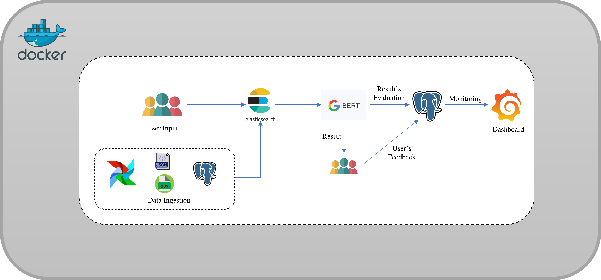
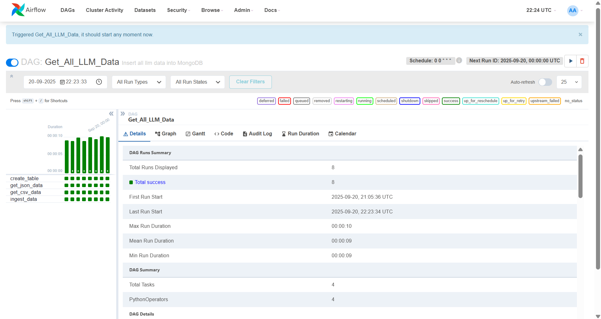
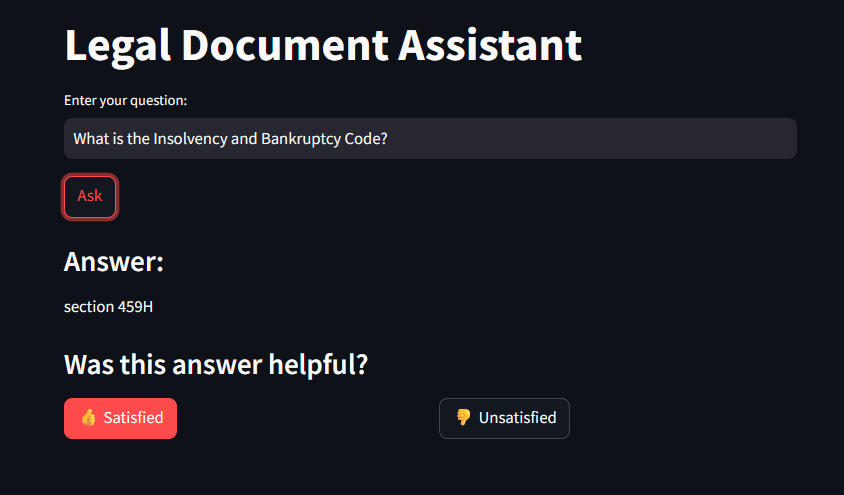
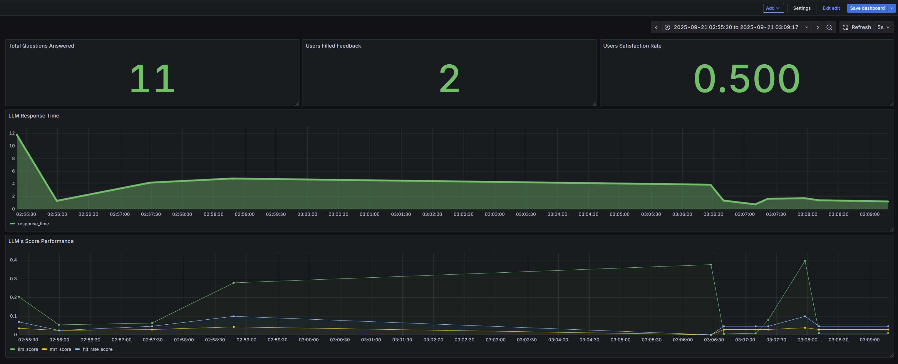

# ⚖️ Legal Document Assistant

> An AI-powered legal research assistant that combines **Retrieval-Augmented Generation (RAG)**, **PostgreSQL**, **Elasticsearch**, **Apache Airflow**, **Hugging Face**, **Streamlit**, **Docker**, and **Grafana** to make legal document search faster, more relevant, and easier to monitor.

---

## 📌 Overview

Legal professionals often need to search through large collections of case law, statutes, legal documents, and other reference material. Traditional keyword-based research can be slow and may make it difficult to identify the most relevant information quickly.

The **Legal Document Assistant** addresses this challenge with a retrieval-first architecture. Legal data is ingested through an automated Airflow pipeline, stored in PostgreSQL, indexed in Elasticsearch, and retrieved in response to user questions. The retrieved context is then passed to the language-processing component to produce a contextually relevant response.

The application provides:

- 🔎 Fast legal document retrieval
- 🤖 Context-aware question answering
- 📚 Case-law and legal-text search
- 🔄 Automated data ingestion and indexing
- 📊 RAG evaluation using Hit Rate and MRR
- 📈 Real-time application and quality monitoring
- 🐳 Docker-based deployment
- 🖥️ Interactive Streamlit interface

> **Important:** This project is intended as a legal research and information-retrieval aid. It does not replace professional legal advice, legal review, or verification against authoritative sources.

---

## 🎯 Problem Statement

Legal organizations work with large and continuously growing collections of documents. Manually searching these collections can be:

- Time-consuming
- Difficult to scale
- Sensitive to query wording
- Prone to overlooking relevant information
- Inefficient when multiple documents must be compared

A useful legal assistant therefore needs to retrieve relevant information quickly while preserving enough context for users to evaluate the retrieved material.

---

## 💡 Solution

The Legal Document Assistant uses a **Retrieval-Augmented Generation (RAG) workflow**:

1. Legal datasets are extracted from source files.
2. Apache Airflow orchestrates the ingestion workflow.
3. Cleaned data is stored in PostgreSQL.
4. Relevant document content and metadata are indexed in Elasticsearch.
5. A user submits a legal question through Streamlit.
6. Elasticsearch retrieves relevant documents.
7. Retrieved context is passed to the language-processing component.
8. The application returns a context-aware response.
9. Query performance, retrieval quality, and user feedback are exposed through Grafana.

### RAG Architecture



---

## 🏗️ System Architecture

```text
                    ┌─────────────────────┐
                    │   Legal Data Files  │
                    │   CSV / JSON / QA   │
                    └──────────┬──────────┘
                               │
                               ▼
                    ┌─────────────────────┐
                    │   Apache Airflow    │
                    │  ETL / Orchestration│
                    └──────────┬──────────┘
                               │
                               ▼
                    ┌─────────────────────┐
                    │     PostgreSQL      │
                    │ Storage + Metadata  │
                    └──────────┬──────────┘
                               │
                         Index / Sync
                               │
                               ▼
                    ┌─────────────────────┐
                    │    Elasticsearch    │
                    │ Retrieval / Ranking │
                    └──────────┬──────────┘
                               │
                        Relevant Context
                               │
                               ▼
┌───────────────┐     ┌─────────────────────┐
│   Streamlit   │────▶│ RAG / QA Component  │
│   Web App     │     │ Hugging Face Model  │
└───────┬───────┘     └──────────┬──────────┘
        │                         │
        │                         ▼
        │                 Contextual Answer
        │
        ▼
┌──────────────────────────────────────────┐
│                  Grafana                 │
│ Response Time • Feedback • Hit Rate • MRR│
└──────────────────────────────────────────┘
```

---

## 📚 Datasets

The project uses the following publicly available datasets:

1. **Open Australian Legal QA Dataset**  
   https://www.kaggle.com/datasets/umarbutler/open-australian-legal-qa/data?select=qa.jsonl

2. **Legal Text Classification Dataset**  
   https://www.kaggle.com/datasets/amohankumar/legal-text-classification-dataset

---

## 🧰 Tech Stack

| Component | Technology | Purpose |
|---|---|---|
| Programming Language | Python | Application and data-processing logic |
| UI | Streamlit | Interactive legal question-answering interface |
| Orchestration | Apache Airflow | Automated ingestion and indexing workflows |
| Database | PostgreSQL | Structured storage and document metadata |
| Search | Elasticsearch | Fast full-text retrieval and ranking |
| NLP / QA | Hugging Face model | Question answering over retrieved context |
| Monitoring | Grafana | Metrics, performance, and feedback monitoring |
| Deployment | Docker / Docker Compose | Reproducible multi-service deployment |

---

## 🔍 Retrieval Pipeline

The retrieval layer combines **PostgreSQL** for structured persistence with **Elasticsearch** for high-performance search.

### 1. Data Storage

Legal documents and associated metadata are stored in PostgreSQL. The database provides structured storage for document information such as document type, case information, and legal metadata.

### 2. Elasticsearch Indexing

Data from PostgreSQL is indexed into Elasticsearch. Elasticsearch provides efficient full-text search and relevance-based ranking over the legal corpus.

### 3. Query Retrieval

When a user submits a question:

```text
User Question
     │
     ▼
Elasticsearch Search
     │
     ▼
Relevant Legal Documents
     │
     ▼
Ranked Context
     │
     ▼
RAG / QA Component
     │
     ▼
Final Response
```

---

## 🤖 Retrieval-Augmented Generation / QA

The application combines document retrieval with a Hugging Face question-answering model.

The referenced model is:

**`google-bert/bert-large-uncased-whole-word-masking-finetuned-squad`**

Hugging Face:
https://huggingface.co/google-bert/bert-large-uncased-whole-word-masking-finetuned-squad

The retrieval stage provides relevant legal context, while the model processes the question together with that context.

### Why Retrieval First?

Retrieval-first processing helps the application:

- Ground responses in the indexed legal corpus
- Reduce irrelevant context
- Retrieve relevant case-law passages
- Separate document search from answer generation
- Measure retrieval quality independently

---

## 🔐 Configuration & Secrets

Do **not** commit API keys directly to `docker-compose.yml`.

Instead, create a `.env` file:

```env
HUGGINGFACE_KEY=your_huggingface_token
```

Then reference the variable from Docker Compose:

```yaml
services:
  app:
    build: ./llm-app
    container_name: llm_app
    environment:
      HUGGINGFACE_KEY: ${HUGGINGFACE_KEY}
    volumes:
      - ./llm-app:/app
    networks:
      - network
    depends_on:
      - elasticsearch
    ports:
      - "8501:8501"
```

Add `.env` to `.gitignore`:

```gitignore
.env
*.env
```

> Never push Hugging Face tokens, database passwords, or other credentials to GitHub.

---

## 🔄 Data Ingestion Pipeline

Apache Airflow manages the ingestion workflow.



### Pipeline

```text
CSV / JSON
    │
    ▼
Extract
    │
    ▼
Clean & Transform
    │
    ▼
PostgreSQL
    │
    ▼
Index
    │
    ▼
Elasticsearch
    │
    ▼
Available for Retrieval
```

### Pipeline Responsibilities

**Extraction**

Loads legal data from CSV and JSON sources.

**Transformation**

Cleans and prepares records for database storage.

**Loading**

Writes processed records to PostgreSQL.

**Indexing**

Exports the required data from PostgreSQL and indexes it into Elasticsearch.

**Monitoring**

Airflow provides workflow execution and failure monitoring.

---

## 🖥️ Streamlit Interface



The Streamlit application provides a simple interface for legal research.

### Main Interaction Flow

1. Enter a legal question.
2. Click **Ask**.
3. The system retrieves relevant legal information.
4. The QA/RAG component processes the retrieved context.
5. The answer is displayed.
6. Provide satisfaction feedback.

This interface makes the retrieval pipeline accessible without requiring users to interact directly with Elasticsearch, PostgreSQL, or Airflow.

---

## 📊 RAG Evaluation

The retrieval pipeline is evaluated using:

### Hit Rate

Measures whether the relevant answer/document appears within a predefined set of top retrieved results.

```text
Hit Rate =
Queries with a relevant result in Top-K
----------------------------------------
             Total Queries
```

### Mean Reciprocal Rank (MRR)

Measures how highly the first relevant result is ranked.

```text
MRR = Average(1 / Rank of First Relevant Result)
```

Higher values indicate that relevant results are appearing closer to the top of the retrieval results.

### Model / QA Score

The project also records scores associated with the Hugging Face QA component to help evaluate response relevance and quality.

---

## 📈 Monitoring with Grafana



Grafana is used to monitor both application usage and retrieval quality.

### Tracked Metrics

| Metric | Purpose |
|---|---|
| Total Questions Answered | Measures system usage |
| Total Feedback Responses | Measures user engagement |
| Satisfaction Rate | Tracks user-reported satisfaction |
| Response Time | Monitors application performance |
| Hit Rate | Measures retrieval success |
| MRR | Measures ranking quality |
| Model / LLM Score | Tracks response quality over time |

The dashboard can be used to identify performance degradation, retrieval-quality issues, and changes in user satisfaction.

---

## 🚀 Getting Started

### Prerequisites

Make sure the following are installed:

- Docker
- Docker Compose
- A Hugging Face account/token

---

### 1. Clone the Repository

```bash
git clone <YOUR_REPOSITORY_URL>
cd <YOUR_REPOSITORY_NAME>
```

---

### 2. Configure Hugging Face

Create a `.env` file:

```env
HUGGINGFACE_KEY=your_huggingface_token
```

Do not commit this file.

---

### 3. Build and Start the Services

```bash
docker compose up --build -d
```

For older Docker Compose installations, the following may also be used:

```bash
docker-compose up --build -d
```

---

### 4. Check Running Containers

```bash
docker compose ps
```

If a service is still starting, inspect its logs:

```bash
docker compose logs -f
```

For a specific service:

```bash
docker compose logs -f app
```

---

## 🌐 Application URLs

Once the services are running:

| Service | URL |
|---|---|
| Streamlit | http://localhost:8501 |
| Airflow | http://localhost:8080 |
| Grafana | http://localhost:3000 |

### Airflow

The original project configuration uses:

```text
Username: airflow
Password: airflow
```

Use the credentials configured in your current `docker-compose.yml`.

From the Airflow UI, start the ingestion DAG and verify that the data is loaded and indexed.

### Streamlit

Open:

```text
http://localhost:8501
```

If Elasticsearch is still initializing, wait for the service to become healthy and refresh the Streamlit application.

### Grafana

Open:

```text
http://localhost:3000
```

Import the provided dashboard configuration:

```text
llm-app/dashboard.json
```

---

## 🧪 Example Questions

You can test the application with questions such as:

```text
Why did the plaintiff wait seven months to file an appeal?

What was the outcome of the case?

Can you provide more details on the clarification provided in Note 1?

Can the landlord avoid liability for breaching this obligation if the state of disrepair is caused by the tenant's actions?

What is the Commonwealth Bank of Australia fixed deposit account?
```

You can also ask other questions that are supported by the indexed legal corpus.

---

## 🛠️ Troubleshooting

### Elasticsearch is still starting

If the application displays:

```text
It seems Elastic Search is still running, please refresh again
```

wait a few seconds and refresh the application.

You can inspect Elasticsearch logs with:

```bash
docker compose logs -f elasticsearch
```

### Check all services

```bash
docker compose ps
```

### Restart the stack

```bash
docker compose down
docker compose up --build -d
```

### View application logs

```bash
docker compose logs -f app
```

### View Airflow logs

```bash
docker compose logs -f airflow
```

---

## 🔒 Security Best Practices

Before deploying this project outside a local development environment:

- Store secrets in environment variables or a secret manager.
- Never commit `.env` files.
- Rotate exposed API tokens immediately.
- Change default Airflow credentials.
- Use strong database credentials.
- Restrict externally exposed ports.
- Enable authentication for production services.
- Validate and sanitize user input.
- Log application errors without storing sensitive information.
- Verify legal answers against authoritative sources before relying on them.

---

## 📁 Project Assets

The repository includes supporting visual assets used in this documentation:

```text
images/
├── airflow.png
├── grafana.png
├── rag1.png
└── streamlit.png
```

The project also references:

```text
llm-app/dashboard.json
```

for the Grafana dashboard configuration.

---

## 🔮 Potential Improvements

The current architecture can be extended with:

- Hybrid lexical + semantic retrieval
- Vector search and embeddings
- Cross-encoder reranking
- Source citations in generated answers
- Conversation history
- Document-level access control
- Better hallucination detection
- Automated retrieval evaluation
- Model latency and token-usage tracking
- More granular legal metadata filtering
- Production-grade authentication and authorization
- CI/CD and automated testing

These are suggested future enhancements and are not required by the current implementation.

---

## 📜 Disclaimer

This project is designed for **legal information retrieval and research assistance**. It should not be treated as a substitute for a qualified lawyer, official legal databases, or authoritative legal advice.

Always verify important legal information against the original source documents and applicable law.

---

## ⭐ Project Summary

The Legal Document Assistant demonstrates how a modern data and AI stack can be combined to build an end-to-end legal research workflow:

```text
Data Ingestion
      ↓
Apache Airflow
      ↓
PostgreSQL
      ↓
Elasticsearch
      ↓
Retrieval
      ↓
RAG / QA
      ↓
Streamlit
      ↓
User Feedback
      ↓
Grafana Monitoring
```

The result is a containerized legal research assistant with automated ingestion, scalable retrieval, context-aware question answering, evaluation metrics, and operational monitoring.
